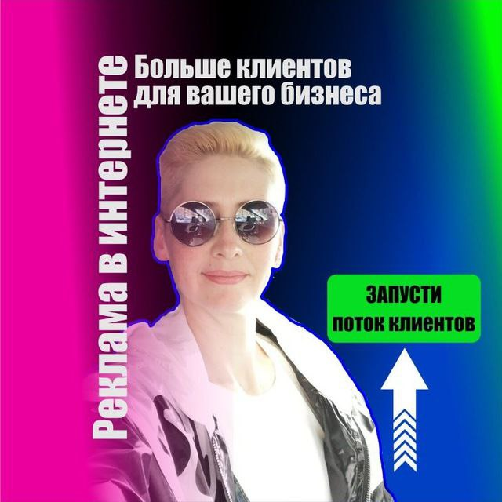

## Приветствую, друзья!

# Меня зовут Зарина Чернова, и я маркетолог с 20-летним опытом работы в финансовой сфере.

**Мои ключевые навыки, как интернет-маркетолога:**
1. Контекстная реклама.
Настраиваю и оптимизирую рекламные кампании в поисковых системах: Поисковая реклама Яндекс.Директ, Реклама в медийной сети Яндекс, Поисковая реклама Google.Adwords, Реклама в медийной сети Google.
2. Яндекс.Карты, Google карты, 2Gis
Заполняю карточки организаций. Слежу за актуальностью информации. Размещаю рекламные креативы.
3. SMM - маркетинг в социальных сетях. 
Увеличиваю узнаваемость бренда. Распространяю рекламный контент. Настраиваю рекламные объявления на целевую аудиторию заказчика.

**А еще:**

✔	Выявляю и отслеживаю действия конкурентов. 

✔	Собираю семантическое ядро для SEO-продвижения.

✔	Работаю с визуальным контентом (изображения, фото). Создаю рекламные креативы в Corel.

✔	Пишу продающие тексты

✔	Владею базовыми знаниями программирования на уровне HTML и CSS. Обучаюсь в NETOLOGY на курсе «Bitrix-разработчик».

**_Если у вас есть сайт, но нет продаж – значит, вы затерялись среди конкурентов, где-то на последних страницах поисковика._**
### Привлеките опытного маркетолога и переложите груз ответственности за продвижение вашего бизнеса на его плечи.

Если вы заинтересованы в повышении продаж с помощью эффективной рекламы, но при этом не готовы “слить” бюджет — обращайтесь https://faidamarket.ru/.

**Займитесь своим любимым делом, а я:**

•	В деталях изучу поставленную задачу и буду действовать в ваших интересах;

•	Предложу комплект услуг под ваш бюджет и маркетинговые задачи;

•	Настрою рекламные объявления на вашу целевую аудиторию в Яндексе;

•	Создам рекламные креативы;

•	Заполню карточки организации на Яндекс.Картах. Буду следить актуальностью информации;

•	Доведу работу над проектом до результативного финала — увеличения или начала продаж.

**❤ Рада, что вы со мной**
